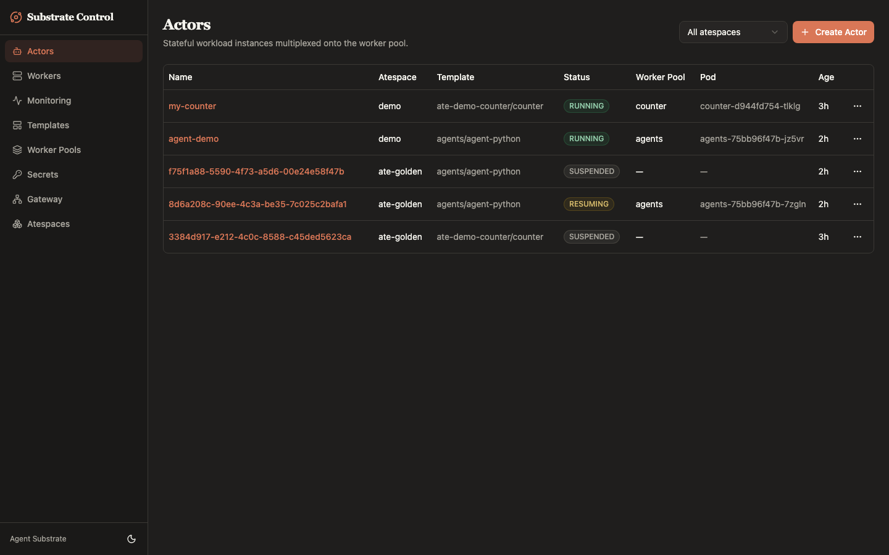
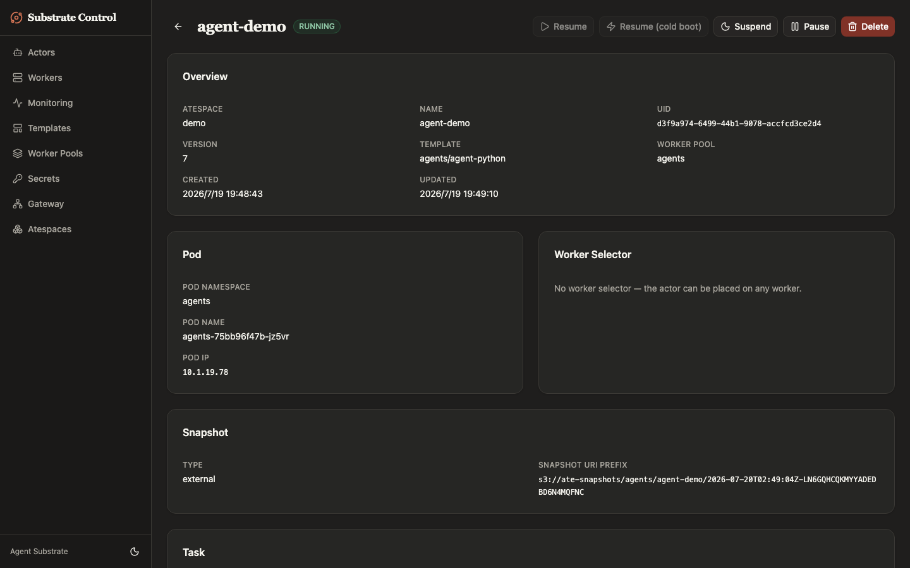
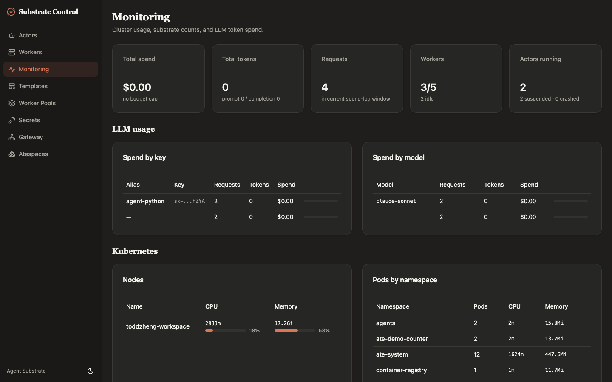
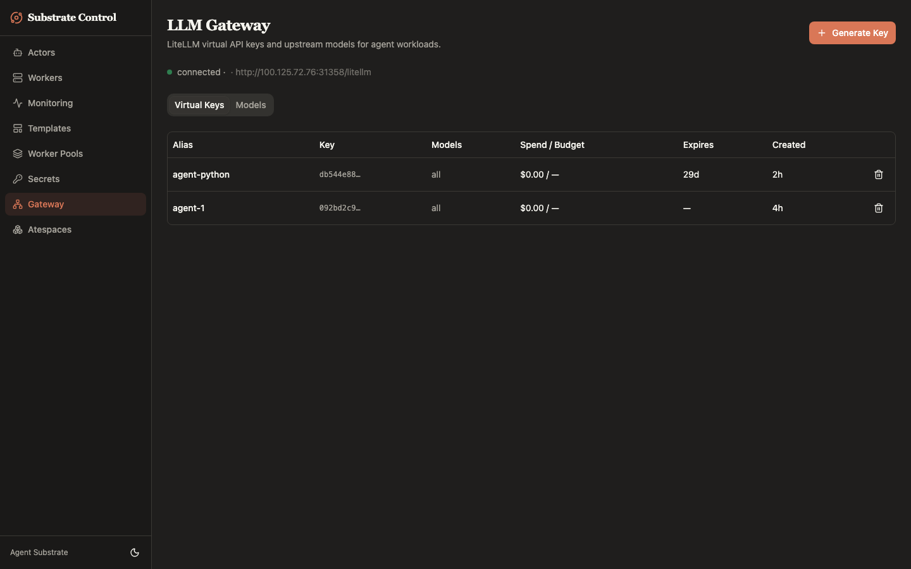

# Substrate Control

A web console for [Agent Substrate](https://github.com/agent-substrate/substrate): actor lifecycle management, Worker/WorkerPool/ActorTemplate (CRD) management, LLM gateway (LiteLLM) virtual keys and upstream model registry, Kubernetes Secrets, and a Task panel for sending requests directly to your actors.

[中文文档](docs/zh-CN/README.md)

## Screenshots

| Actors | Actor detail + Task panel |
|---|---|
|  |  |

| Monitoring (k8s + LLM usage) | Gateway (LiteLLM keys & models) |
|---|---|
|  |  |

Light (Claude-cream) and dark themes are both supported; the shots above are dark mode.

## Architecture

```
Browser (React SPA)
   │  /api/* JSON
   ▼
Go backend (cmd/server)
   ├─ gRPC ──► ate-api-server   (kubectl port-forward + SA token locally;
   │                             in-cluster service DNS + projected SA token in-pod)
   ├─ k8s API ──► ActorTemplate / WorkerPool CRDs, Secrets (client-go dynamic client)
   ├─ HTTP ──► LiteLLM gateway (master key read from cluster Secret, never proxied to the browser)
   └─ HTTP ──► atenet-router (actor traffic, via ingress)
```

Three connection modes, auto-detected at startup: `direct` (`SUBSTRATE_GRPC_ADDR` set), `incluster` (inside a pod, projected SA token), `portforward` (local default — manages `kubectl port-forward` + token minting/refresh itself).

## Install (any Substrate cluster)

Ships as a single container image (frontend embedded via `go:embed`; no Node required):

```bash
# 1. Build & push an image your cluster can pull
docker buildx build --platform linux/amd64 -t <your-registry>/substrate-control:latest --push .

# 2. Point deploy/kustomization.yaml `images` at your registry
# 3. Deploy (idempotent)
kubectl apply -k deploy/

# 4. Access
kubectl port-forward -n substrate-control svc/substrate-control 8080:8080
```

The backend auto-detects the in-cluster environment: dials `api.ate-system.svc:443` with a projected ServiceAccount token (audience `api.ate-system.svc`). RBAC is least-privilege (see `deploy/rbac.yaml`; cluster-wide secrets access is a documented compromise — see ADR-0002). LiteLLM and metrics-server are optional: the corresponding UI sections degrade gracefully when absent. Ingress exposure is the operator's choice (see the comment at the top of `deploy/kustomization.yaml`).

## Local development

```bash
# Prerequisite: kubeconfig points at the target cluster

make build        # backend bin/server + frontend dist
make run          # http://localhost:8080 (production mode, single port)

# Dev mode (two terminals)
./bin/server                    # backend :8080 (portforward mode)
cd frontend && npm run dev      # frontend :5173 (hot reload, /api proxied)
```

## Pages

| Page | What it does |
|---|---|
| Actors | List/detail/create actors; suspend / resume (incl. cold boot) / pause / delete; **Task panel** (send HTTP requests straight to the actor) |
| Workers | Physical worker inventory (total / assigned / idle) |
| Monitoring | Node & pod CPU/memory (metrics-server), substrate counts, LiteLLM spend/token usage, recent request logs |
| Templates | ActorTemplate create (form/YAML, harness presets for Claude Code & Codex) / delete / inspect |
| Worker Pools | WorkerPool create (labels matched by template workerSelector) / delete / inspect |
| Secrets | k8s Opaque secrets (write-only values, never displayed) |
| Gateway | LiteLLM admin: virtual keys (generate/delete/save-as-k8s-Secret) and upstream model registry (credentials encrypted at rest) |
| Atespaces | Atespace create / delete / list |

## Configuration (env)

| Variable | Default | Purpose |
|---|---|---|
| `LISTEN_ADDR` | `:8080` | HTTP listen address |
| `SUBSTRATE_GRPC_ADDR` | empty | When set: direct mode (no port-forward/auth) |
| `SUBSTRATE_API_ADDR` | `api.ate-system.svc:443` | In-cluster API address override |
| `SUBSTRATE_TOKEN_FILE` | `/run/ateapi-token/token` | In-cluster SA token path |
| `SUBSTRATE_PF_NAMESPACE` / `SUBSTRATE_PF_TARGET` / `SUBSTRATE_PF_LOCAL_PORT` | `ate-system` / `deploy/ate-api-server` / `18443` | port-forward parameters |
| `SUBSTRATE_SA` / `SUBSTRATE_SA_NAMESPACE` / `SUBSTRATE_TOKEN_AUDIENCE` | `ate-api-server` / `ate-system` / `api.ate-system.svc` | token minting parameters (portforward mode) |
| `SUBSTRATE_ROUTER_ADDR` | `http://100.125.72.76:31358` (in-cluster: `http://atenet-router.ate-system.svc`) | actor traffic entrypoint (Task panel proxy target) |
| `LITELLM_URL` | `http://100.125.72.76:31358/litellm` (in-cluster: `http://litellm.litellm.svc:4000`) | LiteLLM admin endpoint |
| `LITELLM_MASTER_KEY` | empty | Overrides the master key; by default read from cluster Secret `litellm/litellm-secrets` |
| `KUBECONFIG` | standard rules | k8s access (local modes) |

## Development

```bash
make proto   # regenerate gRPC code (proto/ateapipb → gen/; toolchain vendored in ./bin)
make tidy    # go mod tidy + frontend typecheck
```

- API contract: `API_CONTRACT.md` (single source of truth shared by backend and frontend)
- gRPC definitions vendored from upstream `pkg/proto/ateapipb/ateapi.proto`
- Frontend: Vite + React + TS + Tailwind + shadcn/ui + TanStack Query (5s polling)

## Docs

- `docs/cluster-setup.md` (中文) — full record of cluster-side changes on the reference MicroK8s setup
- `docs/agent-images.md` (中文) — how to build and deploy agent workload images
- `docs/adr/0001-tool-gateway.md` — ADR: tool registry + tool gateway
- `docs/adr/0002-in-cluster-distribution.md` — ADR: in-cluster distribution
- `examples/agent-python/` — minimal agent image example (LiteLLM gateway + durableDir persistence)
